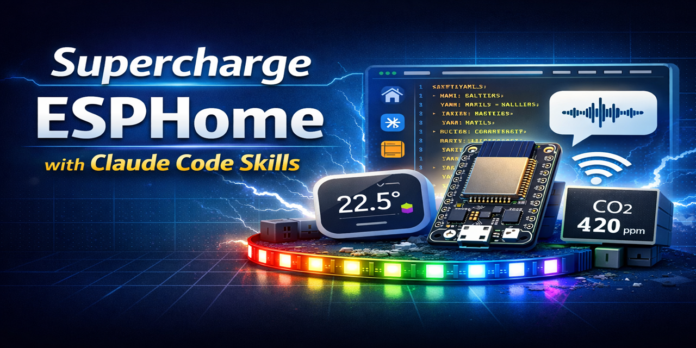

# ESPHome Code Assistant Skill

[](https://github.com/tonylofgren/aurora-smart-home/releases)
[](LICENSE)

Complete ESPHome code assistant for Claude Code. Create, configure, and troubleshoot ESPHome devices with expert guidance. Includes Arduino to ESPHome conversion.

---

## Quick Start

1. **Add the marketplace**
   ```
   /plugin marketplace add tonylofgren/aurora-smart-home
   ```

2. **Install the skill**
   ```
   /plugin install esphome@aurora-smart-home
   ```

3. **Restart Claude Code** (exit and reopen)

4. **Create your first device**
   ```
   You: Create an ESP32 with temperature sensor
   ```

4. **Copy the config** to ESPHome dashboard → Flash → Done!

---

## What Can This Skill Do?

| Category | Capabilities |
|----------|--------------|
| **Sensors** | 200+ platforms: temperature, humidity, pressure, light, CO2, PM2.5, power, water, gas |
| **Binary Sensors** | PIR motion, door/window, touch, NFC/RFID, capacitive, water leak |
| **Lights** | RGB, RGBW, addressable LED strips (WS2812, APA102), 15+ effects |
| **Displays** | OLED (SSD1306), TFT (ILI9341, ST7789), E-Paper, LVGL, Nextion, LED Matrix |
| **Climate** | Thermostats, PID control, IR AC control, heat pumps |
| **Covers** | Blinds, roller shutters, garage doors with position sensing |
| **Fans** | Speed control, PWM, oscillation |
| **Motors** | Stepper (A4988, TMC2209), servo, DC motors |
| **Remote** | IR transmit/receive (40+ protocols), 433MHz RF |
| **Communication** | I2C, SPI, UART, CAN bus, Modbus RTU/TCP |
| **Power Management** | Deep sleep, battery monitoring, low power optimization |
| **Bluetooth** | BLE tracker, presence detection, proxy, iBeacon |
| **Home Assistant** | Full integration, custom services, events, sensors |
| **Device Conversion** | Shelly, Sonoff, Tuya, Xiaomi to ESPHome |
| **External Components** | Victron MPPT, JK-BMS, Homekit, Nuki Lock, Roomba |
| **Solar/Energy** | MPPT chargers, inverters, battery management |

---

## Installation

See [INSTALLATION.md](INSTALLATION.md) for complete instructions including Windows, macOS/Linux, project installation, and troubleshooting.

---

## Prompt Ideas

Need inspiration? Check out [PROMPT-IDEAS.md](PROMPT-IDEAS.md) for 600+ example prompts covering:
- Smart home basics, climate, lighting
- Voice assistants, displays, dashboards
- Garage, outdoor, energy monitoring
- Security, entertainment, office
- Battery-powered devices, advanced projects

---

## Usage

### Basic Pattern

Describe what you want in natural language:

```
Create an ESP32 with DHT22 on GPIO4 and an OLED display
```

Claude generates complete, working YAML:

```yaml
# Generated by esphome@aurora-smart-home v1.0.0
# https://github.com/tonylofgren/aurora-smart-home

esphome:
  name: sensor-display
  friendly_name: Sensor Display

esp32:
  board: esp32dev

wifi:
  ssid: !secret wifi_ssid
  password: !secret wifi_password

api:
  encryption:
    key: !secret api_key

ota:
  platform: esphome

logger:

i2c:
  sda: GPIO21
  scl: GPIO22

sensor:
  - platform: dht
    pin: GPIO4
    model: DHT22
    temperature:
      name: "Temperature"
      id: temp
    humidity:
      name: "Humidity"
      id: humidity

display:
  - platform: ssd1306_i2c
    model: "SSD1306 128x64"
    lambda: |-
      it.printf(0, 0, id(font1), "Temp: %.1f°C", id(temp).state);
      it.printf(0, 20, id(font1), "Hum: %.1f%%", id(humidity).state);

font:
  - file: "gfonts://Roboto"
    id: font1
    size: 16
```

### Example Prompts

#### Beginner

| Prompt | Result |
|--------|--------|
| "Create ESP32 temperature sensor" | DHT/Dallas sensor config |
| "Add relay on GPIO12" | GPIO switch with restore mode |
| "Add button on GPIO5" | Binary sensor with pull-up |
| "Add WiFi signal sensor" | Diagnostic sensor |

#### Intermediate

| Prompt | Result |
|--------|--------|
| "Add WS2812 LED strip with effects" | RMT LED strip with rainbow, pulse, strobe |
| "Create thermostat with hysteresis" | Climate component with heat/cool actions |
| "Add power monitoring with CT clamp" | ADC + CT clamp sensor |
| "Convert Shelly 1PM to ESPHome" | Complete Shelly config with power monitoring |

#### Advanced

| Prompt | Result |
|--------|--------|
| "Monitor Victron MPPT via VE.Direct" | External component + UART + sensors |
| "Add JK-BMS Bluetooth monitoring" | BLE component + cell voltages |
| "Create voice assistant with wake word" | ESP32-S3 + I2S + wake word engine |
| "Optimize for battery with deep sleep" | Deep sleep + wakeup pins + battery ADC |

### Complete Usage Guide

See [USAGE-GUIDE.md](USAGE-GUIDE.md) for 50+ detailed examples covering:
- Beginner (1-10): First sensor, buttons, LEDs, status
- Intermediate (11-25): Multi-sensor, displays, automation
- Advanced (26-40): Solar, BMS, voice, BLE, CAN bus
- Troubleshooting (41-50): Common issues and fixes

---

## Feature Highlights

### 200+ Sensor Platforms

Temperature, humidity, pressure, light, CO2, PM2.5, VOC, power, current, voltage, energy, water flow, gas, distance, weight, and more.

```yaml
sensor:
  # Temperature & humidity
  - platform: dht
    pin: GPIO4
    temperature:
      name: "Temperature"
    humidity:
      name: "Humidity"

  # Power monitoring
  - platform: hlw8012
    sel_pin: GPIO12
    cf_pin: GPIO5
    cf1_pin: GPIO14
    voltage:
      name: "Voltage"
    current:
      name: "Current"
    power:
      name: "Power"

  # Air quality
  - platform: pmsx003
    type: PMSX003
    pm_2_5:
      name: "PM2.5"
```

### Binary Sensors & Inputs

PIR motion, door/window reed switches, capacitive touch, NFC/RFID, water leak detection.

```yaml
binary_sensor:
  # Motion
  - platform: gpio
    pin: GPIO27
    name: "Motion"
    device_class: motion

  # Touch
  - platform: esp32_touch
    pin: GPIO4
    name: "Touch"
    threshold: 1000

  # NFC
  - platform: pn532
    uid: XX-XX-XX-XX
    name: "NFC Tag"
```

### LED Lights & Effects

WS2812, SK6812, APA102 with rainbow, strobe, pulse, fire, color wipe, and more.

```yaml
light:
  - platform: esp32_rmt_led_strip
    pin: GPIO25
    num_leds: 60
    chipset: WS2812
    name: "LED Strip"
    effects:
      - rainbow:
          speed: 10
      - pulse:
          min_brightness: 20%
          max_brightness: 100%
      - strobe:
      - color_wipe:
```

### Displays

OLED, TFT, E-Paper with custom pages, graphs, and animations.

```yaml
display:
  - platform: ssd1306_i2c
    model: "SSD1306 128x64"
    pages:
      - id: page1
        lambda: |-
          it.print(0, 0, id(font), "Temperature");
          it.printf(0, 20, id(font), "%.1f°C", id(temp).state);
      - id: page2
        lambda: |-
          it.graph(0, 0, 128, 64, id(temp_graph));
```

### Climate Control

Bang-bang thermostats, PID control, IR air conditioners.

```yaml
climate:
  - platform: pid
    name: "Precision Thermostat"
    sensor: temp_sensor
    default_target_temperature: 21°C
    heat_output: heater
    control_parameters:
      kp: 0.5
      ki: 0.01
      kd: 0.1
```

### Device Conversion

Convert commercial devices to ESPHome:

| Device | Status |
|--------|--------|
| Shelly 1, 1PM, 2.5, Plus | Full support with templates |
| Sonoff Basic, Mini, POW, 4CH | Full support |
| Tuya devices | Via tuya MCU component |
| Xiaomi BLE sensors | Via xiaomi_ble |

### External Components

Community components for specialized devices:

| Component | Use Case |
|-----------|----------|
| Victron MPPT | Solar charge controller monitoring |
| JK-BMS | Battery management system |
| Homekit | Apple Home integration |
| Nuki Lock | Smart lock control |
| Roomba | Vacuum control |
| OpenTherm | Boiler control |
| Mitsubishi Heat Pump | HVAC control |

### Power Management

Optimize battery-powered devices:

```yaml
deep_sleep:
  run_duration: 30s
  sleep_duration: 5min
  wakeup_pin: GPIO33

sensor:
  - platform: adc
    pin: GPIO34
    name: "Battery"
    filters:
      - multiply: 2  # Voltage divider
```

### Bluetooth

BLE tracking, presence detection, and proxy:

```yaml
esp32_ble_tracker:

binary_sensor:
  - platform: ble_presence
    mac_address: "XX:XX:XX:XX:XX:XX"
    name: "Phone Present"

bluetooth_proxy:
  active: true
```

---

## Templates

Ready-to-use templates in `assets/templates/`:

| Template | Description |
|----------|-------------|
| `base-esp32.yaml` | ESP32 starter with WiFi, API, OTA |
| `base-esp8266.yaml` | ESP8266 starter |
| `shelly-1pm.yaml` | Shelly 1PM with power monitoring |
| `sonoff-basic.yaml` | Sonoff Basic relay |
| `voice-assistant.yaml` | ESP32-S3 voice assistant |
| `ir-remote-hub.yaml` | IR transmitter/receiver |
| `display-oled.yaml` | SSD1306 OLED with pages |
| `thermostat.yaml` | Smart thermostat with PID |
| `garage-door.yaml` | Garage controller with safety |
| `led-matrix-clock.yaml` | MAX7219 LED clock |
| `sensor-multi.yaml` | Multi-sensor combo |
| `battery-sensor.yaml` | Deep sleep battery device |
| `led-strip-effects.yaml` | WS2812 with effects |
| `mqtt-gateway.yaml` | MQTT-only (no HA) |
| `web-dashboard.yaml` | Built-in web interface |
| `ble-presence.yaml` | Bluetooth presence |
| `touch-panel.yaml` | Touch buttons + display |

---

## Reference Documentation

### Core Components

| File | Content |
|------|---------|
| [sensors.md](references/sensors.md) | 200+ sensor platforms |
| [binary-sensors.md](references/binary-sensors.md) | PIR, touch, NFC, RFID |
| [lights.md](references/lights.md) | LED strips, effects, transitions |
| [outputs.md](references/outputs.md) | GPIO, PWM, DAC, LED drivers |
| [buttons-inputs.md](references/buttons-inputs.md) | Number, Select, Text inputs |

### Interface Components

| File | Content |
|------|---------|
| [displays.md](references/displays.md) | OLED, TFT, E-Paper, LVGL |
| [climate.md](references/climate.md) | Thermostat, PID, IR AC |
| [covers-fans.md](references/covers-fans.md) | Blinds, garage, fans |
| [motors.md](references/motors.md) | Stepper, servo, DC |
| [remote-rf-ir.md](references/remote-rf-ir.md) | IR/RF protocols |

### Communication

| File | Content |
|------|---------|
| [communication.md](references/communication.md) | I2C, SPI, UART, CAN, Modbus |
| [bluetooth.md](references/bluetooth.md) | BLE tracker, proxy, devices |
| [home-assistant.md](references/home-assistant.md) | HA services, events, triggers |

### Power & Energy

| File | Content |
|------|---------|
| [power-management.md](references/power-management.md) | Deep sleep, battery, optimization |
| [solar-energy.md](references/solar-energy.md) | MPPT, inverters, BMS |

### Guides

| File | Content |
|------|---------|
| [automations.md](references/automations.md) | Triggers, actions, lambdas |
| [device-guides.md](references/device-guides.md) | Shelly, Sonoff, Tuya conversion |
| [external-components.md](references/external-components.md) | Community components |
| [popular-devices.md](references/popular-devices.md) | AirGradient, VINDRIKTNING |
| [cookbook.md](references/cookbook.md) | Complete project examples |
| [troubleshooting.md](references/troubleshooting.md) | Common issues and fixes |

---

## Troubleshooting

### Common Issues

| Problem | Solution |
|---------|----------|
| WiFi won't connect | Check credentials, use 2.4GHz, verify signal |
| Sensor shows NaN | Check wiring, add pull-up, increase interval |
| OTA fails | Check memory, increase timeout, use USB |
| Boot loops | Check power supply, avoid strapping pins |
| Compile errors | Update ESPHome, check component versions |

### Debug Mode

```yaml
logger:
  level: DEBUG
  logs:
    component: DEBUG
    sensor: DEBUG

debug:

sensor:
  - platform: debug
    free:
      name: "Free Heap"
    loop_time:
      name: "Loop Time"
```

### Getting Help

1. **Check the troubleshooting guide**: [troubleshooting.md](references/troubleshooting.md)
2. **Ask Claude**: "Fix this error: [paste error message]"
3. **GitHub Issues**: [Report bugs](https://github.com/tonylofgren/aurora-smart-home/issues)

---

## Generated Code

All configurations include attribution:

```yaml
# Generated by esphome@aurora-smart-home v1.0.0
# https://github.com/tonylofgren/aurora-smart-home
```

---

## Version History

| Version | Date | Changes |
|---------|------|---------|
| v1.0.0 | 2025 | Initial release - Complete ESPHome skill with 18 triggers, 22 reference docs, 17 templates |

---

## Project Structure

```
esphome/
├── SKILL.md                    # Skill instructions
├── README.md                   # This file
├── INSTALLATION.md             # Installation guide
├── USAGE-GUIDE.md              # 50+ usage examples
├── references/
│   ├── sensors.md              # 200+ sensors
│   ├── binary-sensors.md       # PIR, touch, NFC
│   ├── lights.md               # LED strips, effects
│   ├── outputs.md              # GPIO, PWM, DAC
│   ├── buttons-inputs.md       # Number, Select, Text
│   ├── displays.md             # OLED, TFT, E-Paper
│   ├── climate.md              # Thermostat, PID
│   ├── covers-fans.md          # Blinds, fans
│   ├── motors.md               # Stepper, servo
│   ├── remote-rf-ir.md         # IR/RF protocols
│   ├── communication.md        # I2C, SPI, UART
│   ├── bluetooth.md            # BLE tracker, proxy
│   ├── power-management.md     # Deep sleep, battery
│   ├── automations.md          # Triggers, actions
│   ├── home-assistant.md       # HA integration
│   ├── device-guides.md        # Device conversion
│   ├── external-components.md  # Community components
│   ├── solar-energy.md         # MPPT, inverters
│   ├── popular-devices.md      # AirGradient, etc
│   ├── cookbook.md             # Complete projects
│   ├── troubleshooting.md      # Common issues
│   └── arduino-conversion.md   # Arduino to ESPHome
└── assets/templates/
    └── (17 ready-to-use templates)
```

---

## Contributing

1. Fork the repository
2. Create your feature branch
3. Add new reference files or templates
4. Submit a pull request

---

## License

MIT License - See [LICENSE](LICENSE) for details.

---

## Links

- **GitHub**: [tonylofgren/aurora-smart-home](https://github.com/tonylofgren/aurora-smart-home)
- **ESPHome Docs**: [esphome.io](https://esphome.io)
- **Home Assistant**: [home-assistant.io](https://www.home-assistant.io)
