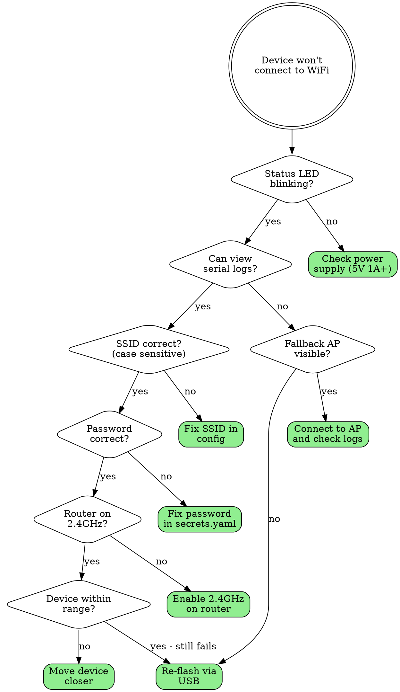
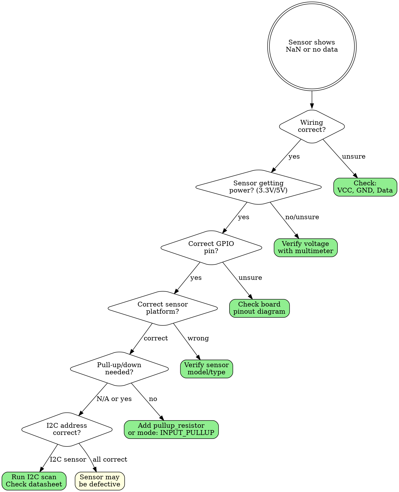
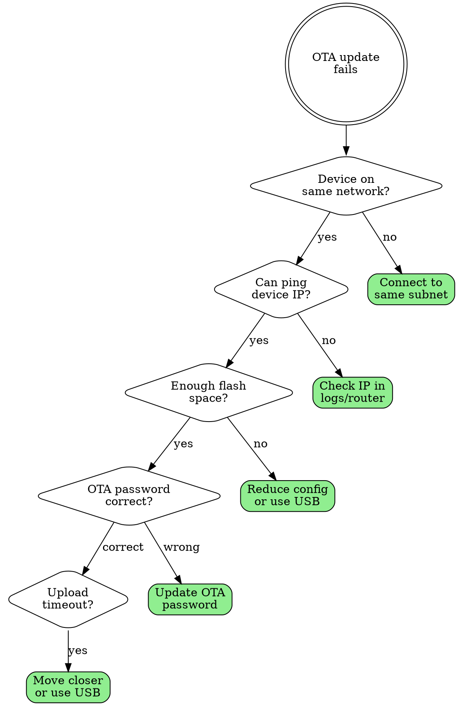
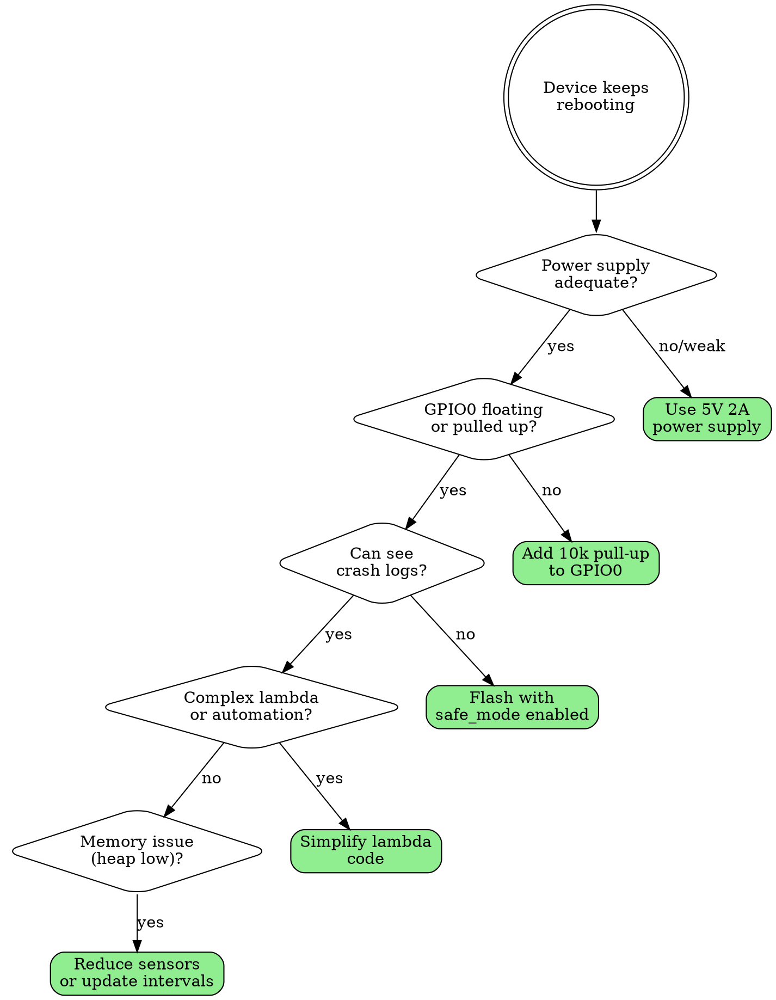

# ESPHome Troubleshooting Flowcharts

Visual decision trees for debugging common ESPHome issues.

## WiFi Connection Issues



**Common WiFi Fixes:**
- Ensure 2.4GHz is enabled (ESP doesn't support 5GHz)
- Check for special characters in SSID/password
- Try `fast_connect: true` in wifi config
- Add `output_power: 20dB` for better range

---

## Sensor Not Reading



**I2C Scan Command:**
```yaml
i2c:
  scan: true  # Shows detected addresses in logs
```

---

## OTA Update Failing



**Tips:**
- Check flash size: ESP8266 needs 1MB+, ESP32 needs 4MB+
- Use `esphome upload device.yaml --device 192.168.x.x`
- Disable antivirus/firewall temporarily

---

## Boot Loop / Crash



**Safe Mode Config:**
```yaml
safe_mode:
  boot_is_good_after: 1min
  num_attempts: 5
```

---

## Quick Debug Commands

```yaml
# Enable debug logging
logger:
  level: DEBUG

# Show free memory
sensor:
  - platform: debug
    free:
      name: "Free Heap"
    loop_time:
      name: "Loop Time"

# I2C device scan
i2c:
  scan: true

# WiFi diagnostics
text_sensor:
  - platform: wifi_info
    ip_address:
      name: "IP Address"
    ssid:
      name: "Connected SSID"
    bssid:
      name: "Connected BSSID"
    mac_address:
      name: "MAC Address"
```

## See Also

- [troubleshooting.md](troubleshooting.md) - Common errors and solutions
- [boards.md](boards.md) - Board pinouts and capabilities
- [power-management.md](power-management.md) - Power supply requirements
