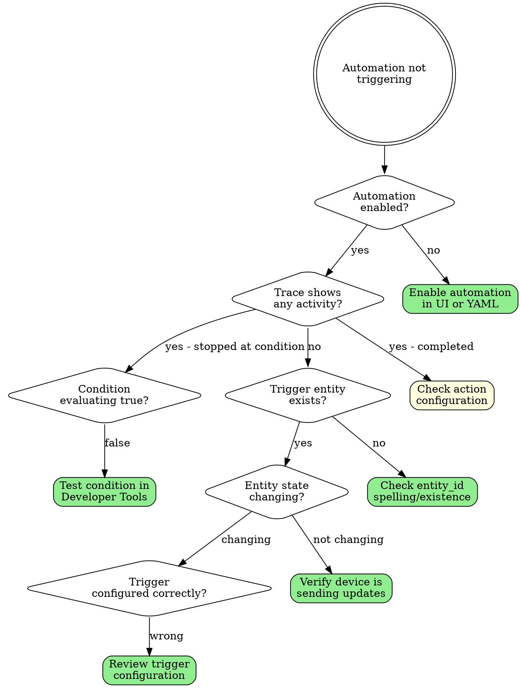
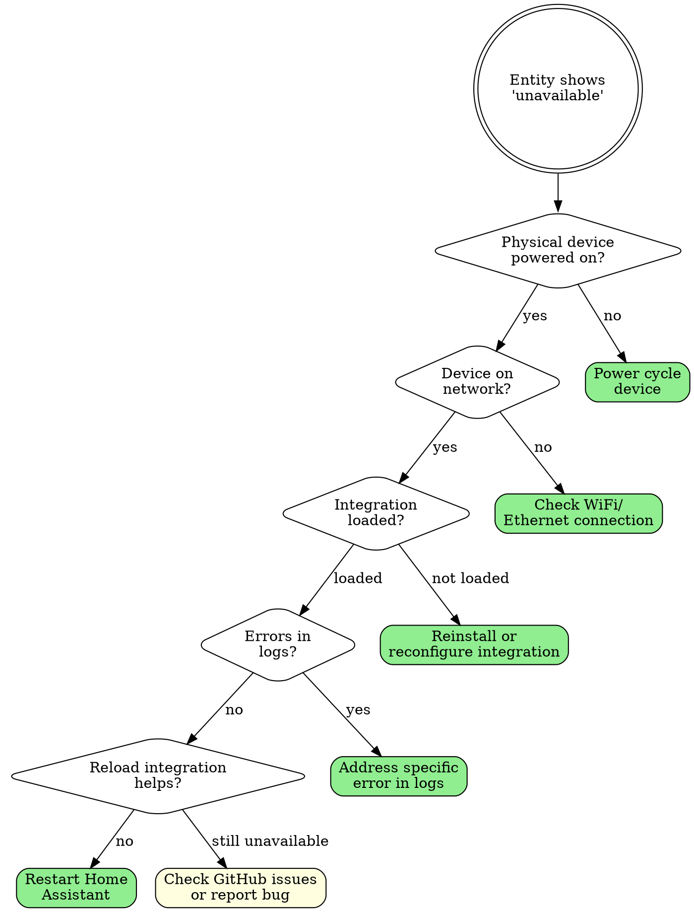
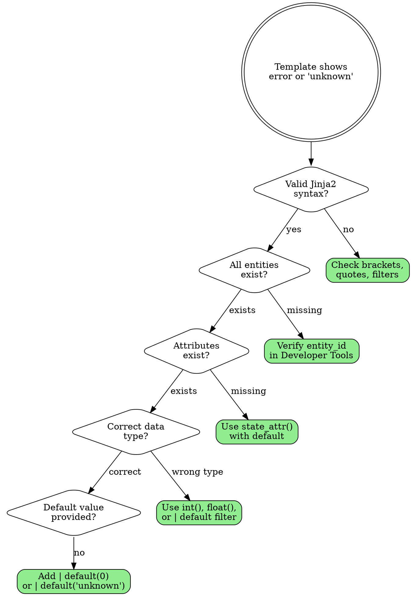
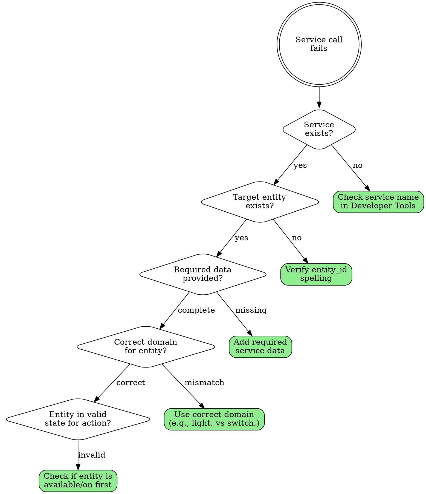
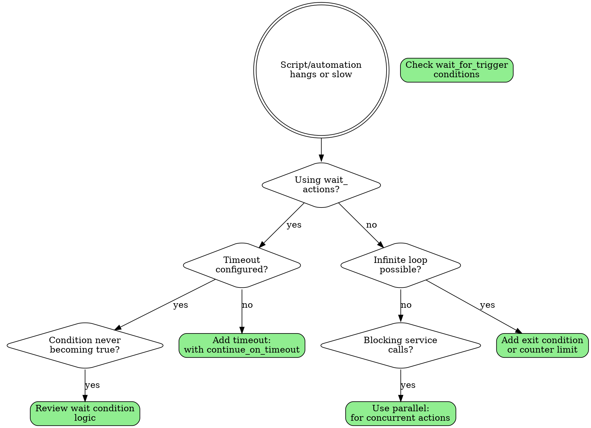

# Home Assistant Troubleshooting Flowcharts

Visual decision trees for debugging common Home Assistant issues.

## Automation Not Triggering



**Debug Commands:**
```yaml
# Check automation state
{{ states.automation.your_automation.state }}

# Check last triggered
{{ states.automation.your_automation.attributes.last_triggered }}

# Force manual trigger for testing
service: automation.trigger
target:
  entity_id: automation.your_automation
```

---

## Entity Unavailable



**Useful Checks:**
```yaml
# Check all unavailable entities

  {{ state.entity_id }}


# Check entity's last changed
{{ states.sensor.example.last_changed }}
```

---

## Template Error



**Common Template Fixes:**

```yaml
# BAD - No error handling
{{ states.sensor.temperature.state }}

# GOOD - With error handling
{{ states('sensor.temperature') | default('unknown') }}

# BAD - Attribute without default
{{ state_attr('sensor.example', 'battery') }}

# GOOD - Attribute with default
{{ state_attr('sensor.example', 'battery') | default(0) }}

# BAD - Math without type conversion
{{ states('sensor.value') + 10 }}

# GOOD - With type conversion
{{ states('sensor.value') | float(0) + 10 }}

# BAD - Assuming entity exists


# GOOD - Check existence first

```

---

## Service Call Failing



**Common Service Issues:**

```yaml
# BAD - Wrong domain
service: switch.turn_on
target:
  entity_id: light.living_room  # This is a light, not switch!

# GOOD - Correct domain
service: light.turn_on
target:
  entity_id: light.living_room

# BAD - Missing required data
service: light.turn_on
target:
  entity_id: light.living_room
data:
  brightness: 255  # Missing brightness_pct OR brightness

# GOOD - Use homeassistant.turn_on for mixed domains
service: homeassistant.turn_on
target:
  entity_id:
    - light.living_room
    - switch.fan
```

---

## Script/Automation Hanging



**Timeout Pattern:**

```yaml
# Wait with timeout
- wait_for_trigger:
    - platform: state
      entity_id: binary_sensor.door
      to: "off"
  timeout:
    minutes: 5
  continue_on_timeout: true

# Check if timed out
- if:
    - condition: template
      value_template: "{{ wait.trigger == none }}"
  then:
    - service: notify.mobile
      data:
        message: "Door still open after 5 minutes!"
```

---

## Quick Debug Tools

### Developer Tools - States

```yaml
# Check entity state
Developer Tools → States → Filter by entity_id

# Common state issues to look for:
# - 'unavailable': Device offline
# - 'unknown': No data received yet
# - 'None': Template error or missing attribute
```

### Developer Tools - Services

```yaml
# Test any service call
Developer Tools → Services → Select service → Fill data → Call Service

# Example test:
Service: light.turn_on
Entity: light.living_room
Service Data:
  brightness_pct: 50
```

### Developer Tools - Template

```yaml
# Test templates live
Developer Tools → Template

# Paste your template:
{{ states('sensor.temperature') | float * 1.8 + 32 }}
# Result shows immediately
```

### Logs

```yaml
# Filter logs for specific integration
Configuration → Settings → Logs → Filter

# Increase log level temporarily:
logger:
  default: info
  logs:
    homeassistant.components.automation: debug
    custom_components.your_integration: debug
```

### Trace

```yaml
# View automation execution trace
Settings → Automations → Click automation → Traces

# Shows:
# - Trigger that fired
# - Condition evaluations
# - Each action step with timing
# - Any errors
```

---

## Common Issues Reference

| Symptom | Likely Cause | Solution |
|---------|--------------|----------|
| Entity unavailable | Device offline | Check power/network |
| Template shows 'unknown' | Entity doesn't exist | Verify entity_id |
| Automation never triggers | Wrong trigger type | Check trigger config |
| Automation triggers but no action | Condition false | Test conditions |
| Service call fails | Wrong domain | Match service to entity type |
| Script hangs | No timeout on wait | Add timeout |
| 'NoneType' error | Missing attribute | Use `default()` filter |
| Float/int error | Wrong type | Use type conversion |

---

## See Also

- [automations.md](automations.md) - Automation reference
- [jinja2-templates.md](jinja2-templates.md) - Template syntax
- [troubleshooting.md](troubleshooting.md) - Common errors
